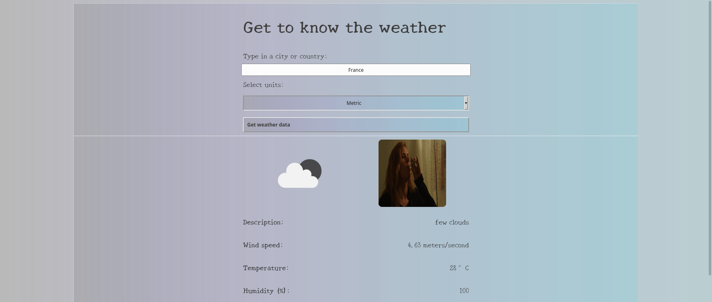

# Weather-API

[Demo](https://alvaroandresruiz.me/weather-api/)

This project is a javascript project that uses the openweather and the giphy API's to fetch some data about the weather in a specific country or city and display it on the screen.

Some features:

- Fetches data from the openweather API and displays it nicely in the screen.
- Uses the giphy API to display a gif related to the current climate.
- ES6 syntax is used, whenever possible.
- The project is modularized, with different files for each section of the page.
- Webpack is used to compile javascript, css and images.

## Usage

- Clone the repo "https://github.com/alvarorf/weather-api.git".
- Run "npm install" to install the required dependencies.
- Open the page.
- Type in the search bar for a city or country.

## Technologies

- JavaScript
- Webpack
- CSS
- HTML
- VSCode

## Author

👤 **Alvaro Ruiz**

- Github: [@alvarorf](https://github.com/alvarorf)
- Twitter: [@aaruizf](https://twitter.com/aaruizf)
- Linkedin: [linkedin](https://www.linkedin.com/in/alvaro-andr%C3%A9s-ruiz-florez/)

## 🤝 Contributing

Contributions, issues, and feature requests are welcome!

## Show your support

Give a ⭐️ if you like this project!

### Acknowledgements

- Microverse
- The Odin Project
